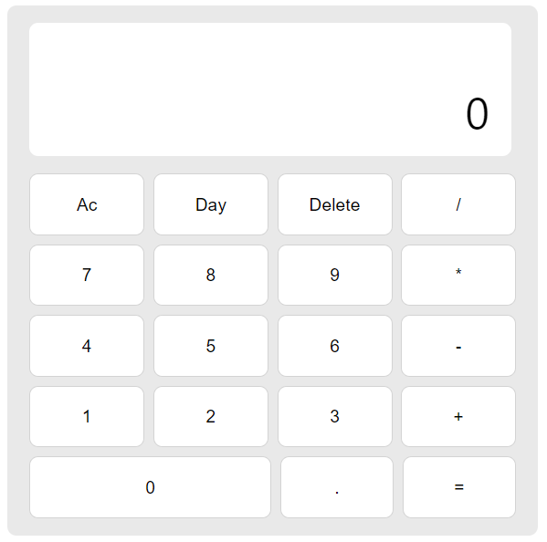

## 계산기
- HTML, CSS, JS로 구성하여 만들었습니다.
- [DEMO](https://verdant-biscotti-876e43.netlify.app/) < 데모 바로가기

### 개발과정

- 버튼을 클릭하였을 때와 키보드를 눌러 값을 넣을 수 있습니다.

- 연산을 진행할 때 해당 연산의 값이 위에 표시 될 수 있습니다.
- `Delete`, `Ac`와 같은 버튼을 통해 입력한 값을 제어할 수 있습니다.
- `Day`, `Night` 기능으로 계산기의 색을 바꿀 수 있습니다.
- 소수점 계산을 하더라도 손실이 발생하지 않습니다.